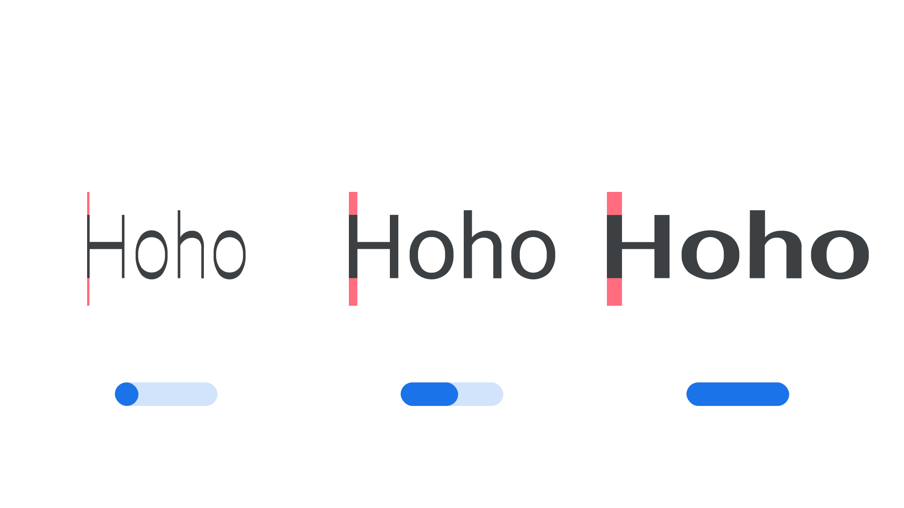

“Parametric Thick Stroke” (`XOPQ` in CSS) is a [parametric axis](/glossary/parametric_axis), found in some [variable fonts](/glossary/variable_fonts), for specifying and varying thick [stroke weights](/glossary/stroke), such as stems.

The [Google Fonts CSS v2 API ](https://developers.google.com/fonts/docs/css2) defines the axis as:

| Default: | Min: | Max: | Step: |
| --- | --- | --- | --- |
| 88 | -1000 | 2000 | 0 |

<figure>

</figure>

Its four-letter abbreviation, XOPQ, is a reference to its logical name, “X Opaque”, which describes how it alters the opaque forms of [glyphs](/glossary/glyph) typically in the X dimension within Latin, such as the stroke weight of the thicker vertical stems in the axis reference glyph, Latin uppercase “H.” However, even within Latin, often the thick strokes are not perfectly aligned to the [cartesian grid](https://en.wikipedia.org/wiki/Cartesian_coordinate_system), such as in `XWVK`, or `O` when there is an [angle of stress](/glossary/axis_in_type_design). 

It’s logically related to the other X dimension axis, [Parametric Counter Width (XTRA)](/glossary/xtra_axis), and the other opaque axis, [Parametric Thin Stroke (YOPQ)](/glossary/yopq_axis). Typically the range of Parametric Thick Stroke varies to a minimum in which the thick strokes are reduced to match the lightest strokes found in the "user axes" (the design space formed by Weight × Width × Optical Size × Slant or Italic axes.) Similarly, the Parametric Thin Stroke axis (YOPQ) varies the thin strokes to a maximum to match the heaviest stroke weights.

In line with the current CSS spec, the four-character code for this axis should be referenced in UPPERCASE (as only the five axes registered in the OpenType format specification should appear in lowercase). Also, when using the Google Fonts API, the lowercase axes have to appear first in the URL, followed by the uppercase, each in alphabetical order.
