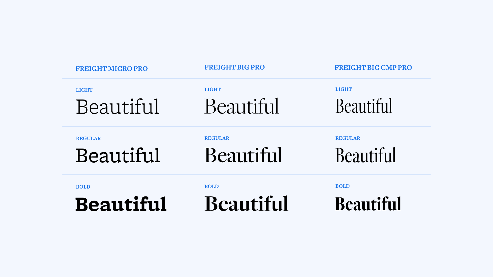
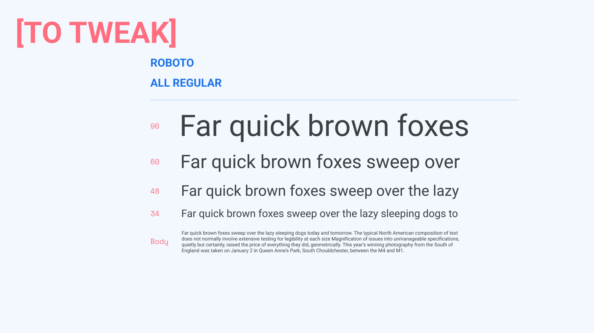
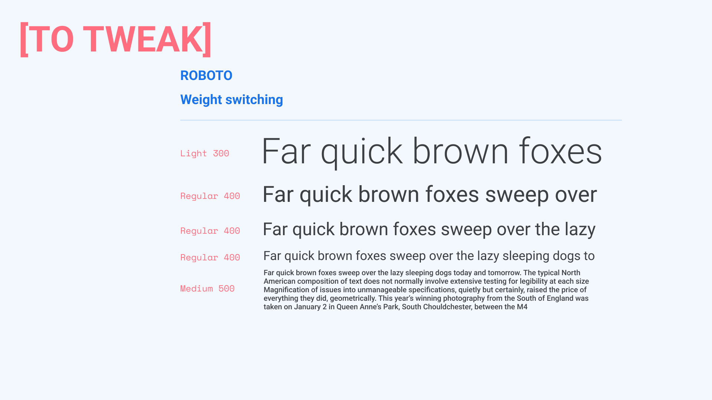
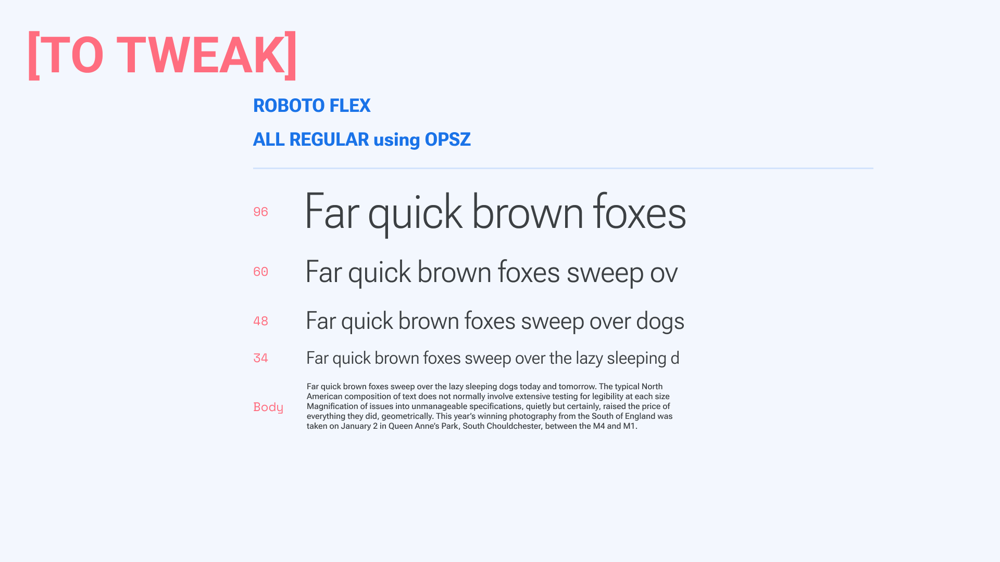
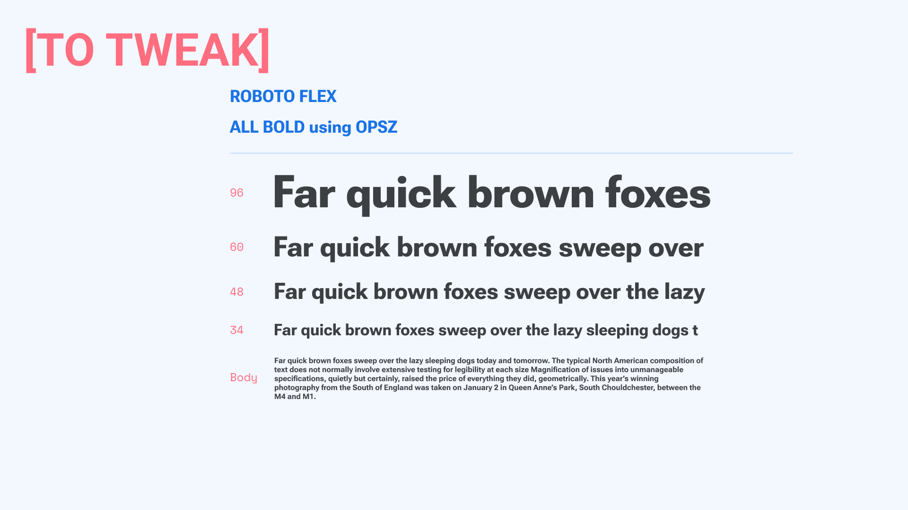
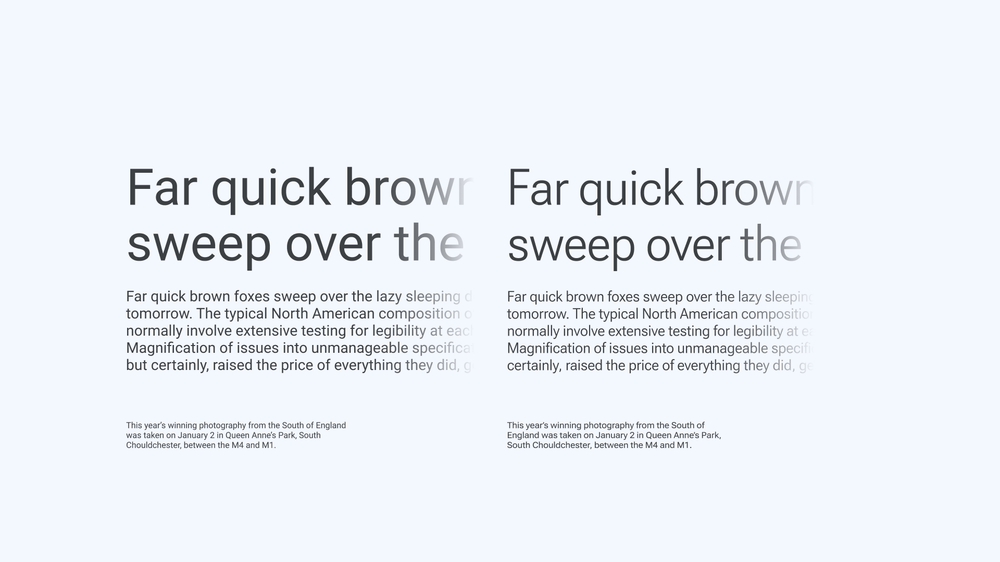
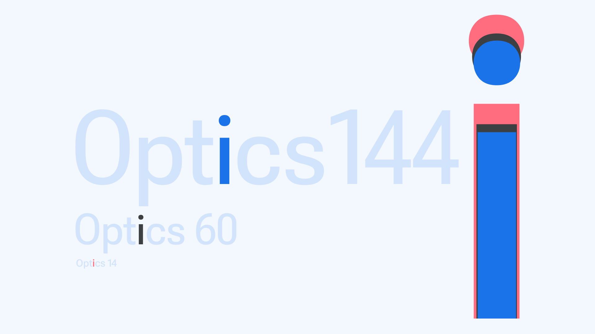

Size wise, [typefaces](/glossary/typeface) have a long history of small [families](/glossary/family_or_type_family_or_font_family): [Style](/glossary/style)-wise, many sizes of metal type gave way to digital systems of multiple [masters](/glossary/masters) for various resolutions. Then came a flourishing of families with a broad range of styles and few size masters in PostScript, followed by [OpenType](/glossary/opentype) continuing the PostScript tradition. And then, finally, [variable fonts](/glossary/variable_fonts).

In early metal types, a set of matrices that covered a short span of sizes from 6 to 11 points was common for a [text](/glossary/text_copy) typeface family. In later hand-set metal types, a family could be so useful and popular as to receive a wide range of sizes, such as from 10 to 96 points.

For most of the 20th century, one kind of typesetting machine specific to rapid setting of text was used exclusively for the smaller sizes, six to 14 point. Meanwhile, [typesetting](/glossary/typesetting) machines of a different kind (from other manufacturers) offered a similar typeface in a range of larger sizes, such as from 18 to 96 points.

But the phototypesetting—and then PostScript desktop—publishing revolutions reduced, and then removed, size-specific designs from common availability and use. These technologies allowed a single typeface design to be scaled uniformly to any size, and even scaled narrower or wider with some distortion.

This created a typographic era where typefaces with specific characteristics were able to flourish across all boundaries of size, dot/pixel resolutions and scripts. And they continue to flourish today, in the forms of the mono-weight san serif, that’s been accepted as a de facto standard regardless of size, resolution, or sensitivity to internationalization. It is possible that the famous faces of the phototypesetting and desktop eras would not be popular if they were launched today, as they became famous when they had size specific designs.

During this period where PostScript, TrueType, and then OpenType standards did not widely support [optical sizes](/glossary/optical_sizes), a small number of foundries developed sets of sibling fonts that offered typefaces each intended for a range of sizes, such as “Text” or [“Display”.](/glossary/display) With real variable fonts, optical size designs are smoothly interpolated, removing the previous boundaries between designs.

<figure>

<figcaption>Freight’s sibling fonts, by Darden Studio.</figcaption>

</figure>

As a fluid range of sizes, with precision in fractions of points from the smallest size to the largest, type designers can now make whatever changes are required for the design over the size range being offered. With this they have a new and important opportunity to assure users that every style of a font family will work, and work just as well as the [“Regular”](/glossary/regular_upright) style, at every size.

A quick overview of how a range of type sizes looks can be shown with a typical “ramp” of type sizes. By comparing a family’s legacy static fonts in a ramp to a variable version of the family with an [optical size axis (`opsz`)](/glossary/optical_size_axis), we’ll show how optical size makes it easier to use a family, and how precise, per-point, size-specific design can improve performance and the overall experience for readers. Then, we’ll go into the details of how optical sizes in Font Bureau fonts are designed to help, and how we recommend they be designed by other foundries and type designers.

<figure>

<figcaption>Ramp with one Regular weight (400), used for all sizes from 8 pt to 96 pt, appears smooth, but at the top and bottom it appears darker and lighter respectively.</figcaption>

</figure>

<figure>

<figcaption>This ramp improves on the prior one with a set of weights switching to “preserve” appearance of ‘regular’ weight, which is typically done when multiple weights are available. The largest size is switched to Light (300), the smallest to Medium (500), and the rest left at Regular (400).</figcaption>

</figure>

<figure>

<figure>This ramp improves further still with a set of optical sizes that are all of Regular weight. This shows that an optical size axis can simplify the specification of type, comfort the user in their ability to just use the weight they want, and to know what the [“bold”](/glossary/bold) and [“italic”](/glossary/italic) of every style is — without hesitation. The “bold” of every 400 weight is simply always 700.</figcaption>

</figure>

Instead of supplying the user with multiple font files to approximate one weight at different sizes, and also to be sorted out into other pairings for many other emphasis styles, `opsz` is typically bundled with at least a weight axis in one file. This takes up less space and downloads faster.

<figure>

<figcaption>This ramp changes tack, to show how the entire group of text styles in Fig. 3 can be changed at once, so all styles change from 400 to 700, while the smooth and even typographic color is retained. This interplay between size and weight is important for type designers to get right to assure users that optical size variations improve the efficiency and accuracy of their typography.</figcaption>

</figure>

<figure>

<figcaption>The left set of text uses <a href="glossary/INSERT_URL">Roboto</a> 14pt design scaled to 48, 14 and 8 pt. The right set uses <a href="/glossary/INSERT_URL">Roboto Flex</a> with the 48pt design at 48 pt, the 14pt at 14 pt, and the 8pt at 8 pt. The design of the single master being 14 pt, used at size in the middle rows, it’s important to note that just 6 points of difference at 8pt, on the 3rd rows, can make the feeling of comfortable reading enjoyed at 14 points fade quickly. Similarly, at 48 point, Regular has become an over-consumer of space on the page, for the amount of information carried by the type.</figcaption>

</figure>

In variable fonts, `opsz` starts with a “default” optical size, strongly recommended to be designed so all the glyphs of that default, function as well as possible at the optical size it is valued as. From that size, the axis can range up, down or both.

The development of the connection between the user, the point size and the type design, starts with the type designer defining the characters and viewing them at their intended point size, in context with other letters of that size, and in consideration of the range of distance a reader is likely to be reading the text at.

The latter, essentially the “user distance per point size of type”, is not an exact measure, due to user choice of how far to sit from (or hold) a device with a screen size and resolution that varies.

But type designs have a few general guidelines to follow, if they choose. Smaller type sizes have a narrow range of distances affording readability, and larger sizes, the opposite. We sometimes move the book a few inches closer to read the tiny footnotes, and we might have to walk fifty feet from a street sign before we can read it. A loose relationship of around an inch of distance per typographic point Is where numbers can be useful.

The second guideline, general to most type design, is the need for slight variations in weights, in spaces and in alignments across the glyphs of a style. This is in essence, “making everything as different as it needs to be, so that it all looks the same.” This has special application along the size axis, as the scaling of type does not affect all the parts of each glyph equally. So the design challenge in optical sizes is to add areas of light as the size master decreases to make it easier on the reader, and remove the light as the size increases, to make room for more content for the reader.

If we could sculpt the head via a different scale than the body, it is an example of just what we do with lowercase “i” on [Latin](/glossary/latin) types. Smaller sizes need a larger dot, carefully sized to be thicker than the stroke below, without becoming so large as to confuse the letter for an “l” at small  sizes, While capable at larger bold sizes of nearly completely filling in the usual transparency between the two parts of the letter.

<figure>

<figcaption>Over a range of sizes being rendered to pixels by modern computers, the type is designed so that the small sizes gather extra pixels into the details, both opaque and transparent, while on the other end, in large sizes, they shed unnecessary pixels, both opaque and transparent.</figcaption>

</figure>

Starting from that simple example, we can see that if I scale the lowercase linearly the dot will disappear before the stroke does. So I make the dot a little bit heavier to make it disappear less. That calls for the need to make the stroke a little bit heavier so that they remain balanced but not as much as the dot gained in opacity. Surrounding these two shapes is a sea of transparent space usually filled with other letters, so the spaces on either side of the “i” need to gain a little bit of transparency to balance the fact that the opacities have just gotten bolder in order to maintain a similar proportion to the larger sizes.

A similar process happens with more complex glyphs as well. The “n” contains two internal transparent spaces, one little triangle at the branch, and a larger one enclosed in “n”’s midst. Proportionally increasing the latter involves making it taller and wider, and once the weight increase of “i” is added, and the opaque branch trimmed for an increased transparent triangle size, we have the shape and size of glyphs for a smaller optical size.

Finally, both “i” and “n” need a little more transparent space on each side, to balance with all the changes to the letters and their insides. With that and relaxation of the kerning pairs, the Latin lowercase for small optical sizes can be understood.

The reverse, scaling laying lowercase up, the same characters generally shed transparency, getting shorter and narrower, more tightly spaced and kerned–all done so as not to lose the proportions while providing a more spatially economical composition.

In cases where the lowercase height adjustment is extreme, the length of lowercase ascenders may need to be adjusted longer, if space and the design allow, and maintaining more closely the proportions of the default size is desired.

Uppercase Latin relies on the same transformations as the lowercase, with the exception of the heights, which may or may not vary, depending on available space, and what modifications have been made to the lowercase ascenders.

Stay tuned for part II that describes how uppercase, figures and punctuation work across optical sizes, and how optical sizes apply to various world scripts.

<figure>

<figcaption>Roboto Flex `opsz` 144 wght 1000 and `opsz` 8 wght 100. The thinnest smallest size (pink), and the boldest largest size (black).</figcaption>

</figure>
