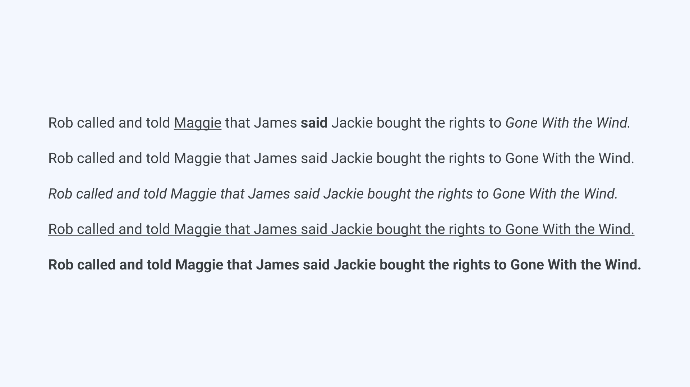
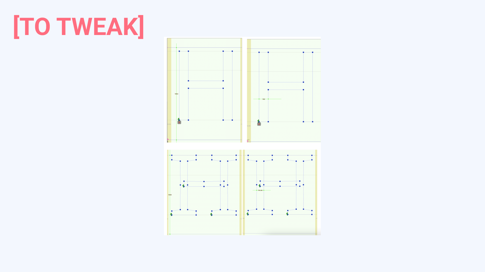
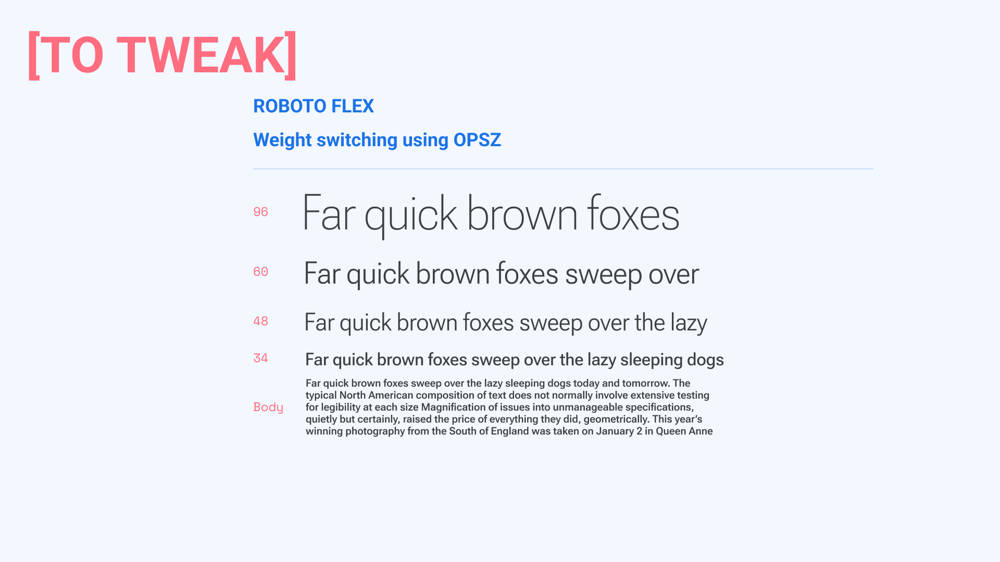
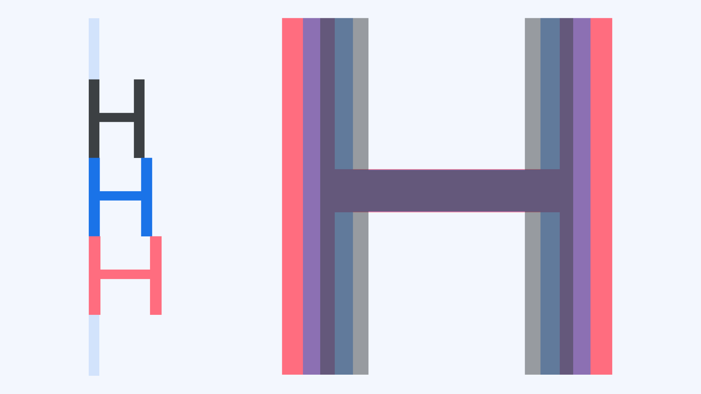
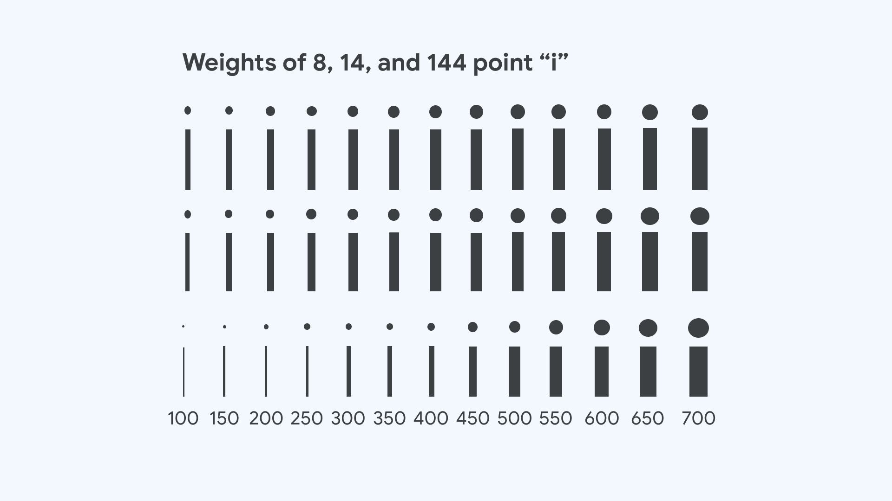

The [weight](/glossary/weight) of a [typeface](/glossary/typeface) has long been expressed by names, like [Regular](/glossary/regular_upright), [Bold](/glossary/bold), Light or Thin, which later called for standard numbers. Today these numbers are represented by the [OpenType](/glossary/opentype) and CSS range from 100 to 1,000, typically assigned in 100’s, with 400 being the “text” weight and 700 the Bold weight of that.

But weight gets more complicated from there. [Latin](/glossary/latin) typefaces designed for reading have a weight around ⅒ of the size, and this has been a guideline for centuries. That’s commonly regular, and not too different among [scripts](/glossary/script_writing_system).

The size and posture of the regular [stroke](/glossary/stroke), which is around ⅒ of the [font](/glossary/font) size, is about the most common repeating stroke of the dominant case of Latin—the capitals. In the type design portion of this article, we will discover that a range of weights from around .9/10ths, to around 1.1/10 is quite common in Latin. We will also explore how weight varies in different designs, as well as across the scripts of the world; where discreet styles’ imposition of a single weight across all the glyphs of all scripts of a font, is not longer the only option.

Until recently, “Times Roman” meant what “Times Roman Regular” meant in Postscript. So while no name for the regular [style](/glossary/style) gave way to Regular, in other styles there were several, like book, medium or plain. And assigning a weight for text became an issue that could be solved by number. So, a number was eventually assigned by IBM, adopted by Microsoft, and then adopted by the WC3—regular is 400.

<figure>

<figcaption>INSERT_CAPTION</figcaption>

</figure>

[The previous article, “Size wise,”](/lesson/size) demonstrates two things about scaling weight. First, that it’s common for a selection of sizes with sufficient differences to be clearly distinguishable from each other, or it’s at least much more common than using every consecutive size. And second, that the appearance of weight changes with size, and if [`opsz`](/glossary/optical_size_axis) corrects the appearance of 400 weight along the size axis to compensate for that, it presents a simpler interface to weight for all.

<figure>

<figcaption>INSERT_CAPTION</figcaption>

</figure>

<figure>

<figcaption>Changes to weight also occur over the [width](/glossary/width) axis, as a [condensed](/glossary/condensed_narrow_compressed) regular style should become lighter in weight, with the opposite variation in wider styles. And of course the [grade](/glossary/grade) axis changes the weight of any style and design space.</figcaption>

</figure>

<figure>

<figcaption>Weight also behaves differently in Latin serif versus sans, with the weight and shape of serifs and contrast to thinner stems playing a role in the visual appearance of that class.</figcaption>

</figure>

<figure>

<figcaption>INSERT_CAPTION</figcaption>

</figure>

Finally, script complexity changes weight, as the contrast between more complex and simple [glyphs](/glossary/glyph) plays a role in determining the range of weight required to provide a consistent appearance from glyph to glyph within a style, and then when weights are added there needs to be a different range of weight variation within most weights. In lighter weights of complex scripts, individual stroke weights become less varied at wght 100, while typically becoming more varied in a heavier weight, like 800.

<figure>

<figcaption>INSERT_CAPTION</figcaption>

</figure>

Confining ourselves to Latin [typography](/glossary/typography), a multi-weight font’s weight can be approached in a variety of ways to affect the appearance of a document. The three major strategies are:

1. Do nothing except to use 400 and 700
2. Fish around visually for desired weight(s), or
3. Figure the weights by values other than the standard os/2 and CSS values that have been in use for several years, and which have caused the regular-to-bold shift in some typefaces to appear more dramatic than the regular-to-bold shift in other typefaces.

How users do this depends quite a bit on what the bold text is for. As previously mentioned, bold has an editorial function, as do [italic](/glossary/italic) and underline. For example, they can make a phrase like ‘“Happy Birthday” stand out visually, without changing its meaning within a passage of text. Bold’sThey change the meaning of ‘“Happy Birthday”, to be clear and not overbearing, so bold’s actual weight has changed a bit since the advent of low resolution displays to be bolder than in print. This was originally to ensure an additional pixel in the weight down to the smallest sizes.

The 1970’s to 1990’s merger of the office and large-publication editorial department saw the appearance of the “bold” and “italic” toggles in word processing and desktop publishing software. When selected simultaneously by the writer, “bold italic” was enabled, which was previously rare in text sizes. This, in turn, brought about the common requirement for type foundries to create a bold italic font. But the issue of its weight being tied to that of the bold makes its irrelevance all the less noteworthy here. Meanwhile, in less editorial, more design-oriented applications of weight, the pre-variable type market saw unprecedented growth in font families with more than five weights—and was well on its way to someone making an eleven weight [family](/glossary/family_or_type_family_or_font_family).

This was luckily saved by [variable fonts](/glossary/variable_fonts). Long ago, the needs of web design for type responsive to portal, size, resolution, and the many preferences for the weight of types opened up the possibility of—and need for—fluid, micro-manageable weight [axes](/glossary/axis_in_variable_fonts).

How they are defined in the weight axes of [Roboto Flex](https://fonts.google.com/specimen/Roboto+Flex), for example, reflects a very broad spectrum of possibilities over a wide range of sizes and widths. This gives us the chance to either use the whole design, or constrain its use to show how fonts with only weight variations, or substantially less range, compare in functionality, i.e.; they’re apples to apples with only different ways of slicing them to compare.

<figure>

<figcaption>INSERT_CAPTION</figcaption>

</figure>

and

<figure>

<figcaption>INSERT_CAPTION</figcaption>

</figure>

Combined within, having the capabilities of [the original Roboto family](https://fonts.google.com/specimen/Roboto), we can now smooth out the transitions between sizes in the original ramp without using [optical sizes](/glossary/optical_sizes), though this further complicates the other weights that might be used in such a ramp.

Sticking with examples that use a simpler approach, not only can whole sections be set darker or lighter, but greater incremental diversity is possible. This has stylistic uses in navigation, but also in contrast over a range of sizes when the background and type colors are not the default.

For the [type designer](/glossary/type_designer), the decision to include or not include optical sizes affects the possible range of weights, as well as how to approach the design. In many typeface families before variable fonts, weights below 300 could easily fail at small sizes on some screens. And as weight increases in a family that is good for texts, but doesn’t have size masters, the type designer has to stop adding weights when the family becomes too bold for text sizes. Otherwise, people will be left to determine for themselves which weight to stop using below a certain size.
