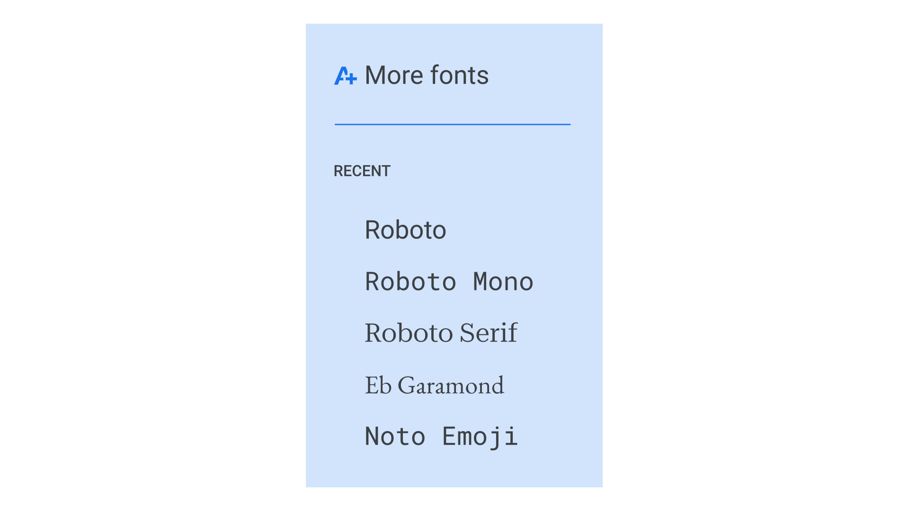

Although it’s possible to practice good typography with whatever typeface we’re handed—even the most basic of defaults can be improved with some thoughtful tweaks to [line-height](/lesson/choosing_a_suitable_line_height), [measure](/lesson/understanding_measure_line_length), and [tracking](https://fonts.google.com/knowledge/using_type/track_carefully_or_not_at_all)—it’s nice to have options. A wider selection of typefaces can help us nail the look and feel we’re going for, or even just give us a larger palette to paint with. 

Google’s Workspace apps, such as Docs, Sheets, and Slides, come with a selection of typefaces to choose from, accessible via the Font menu. But did you know you can actually add _any_ font from the [Google Fonts library](https://fonts.google.com) to this menu, too?

To do this, click on the menu showing the name of the font that’s currently selected. In the dropdown that appears, above the big list of currently available fonts, you’ll notice a “More fonts” button:

<figure>

</figure>

Once you press “More fonts,” a modal dialog window will open where you can start to add to your collection. The dialog has a main list that is populated with all the fonts that are currently available—including any that you might’ve already added previously, indicated in blue and with a check mark. 

Added fonts also appear in the “My fonts” list on the right sidebar. From here you can easily remove unwanted fonts if your list starts to become too long.

<figure>

</figure>

There are a few ways to add a new font. If you know the name, you can search for it, and the list below will be updated with any that match what you’ve typed. Or simply make a selection from the “Scripts,” “Show,” or “Sort” options, and you’ll see that the list updates with a whole new load of fonts you can choose from. 

<figure>

</figure>

Note that the search box and those options work together, so if you’d like to search for a font called “Source” that, for instance, contains glyphs for the Greek script, you could do so. This is also a handy way to quickly check [language support](/lesson/a_checklist_for_choosing_type).

<figure>

</figure>

Tip: If you’re not able to find what you want via this interface, just open up [Google Fonts](https://fonts.google.com) in a new tab, then if you find something you like, make a note of its name and  jump back to Workspace and search for the name in the “More fonts” window.

Note that any fonts you add here will persist within that Workspace app, so once you’ve added a font once, you won’t need to do it again next time you open that app.

Not sure where to start when it comes to choosing a typeface for your document? Check out our article, [“A checklist for choosing type.”](lesson/a_checklist_for_choosing_type)
